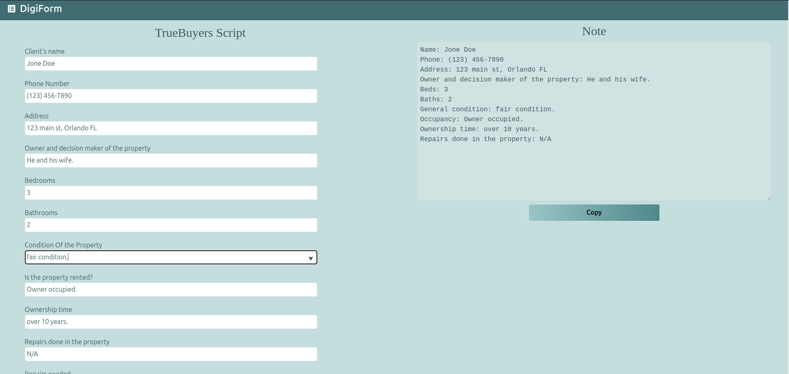

# Digi-Form

DigiForm is an innovative application specifically designed to help cold callers optimize their time and improve efficiency in the sales process. The application offers a range of features and tools designed to facilitate note creation and minimize wrap-time, allowing sales representatives to focus on what matters most: establishing meaningful connections with potential customers and closing deals.

You can check a [demo](https://digi-form.vercel.app/script/demo) or a real [usecase](https://digi-form.vercel.app/script/TrueBuyers)

## Benefits

- [X] **Time-saving**: Automatic note generation and predefined templates allow sales representatives to quickly take notes and reduce time spent on administrative tasks.

- [X] **Improved efficiency**: By minimizing wrap-time, salespeople can make more calls and have more interactions with potential customers, increasing sales opportunities.

- [X] **Personalization and consistency**: Predefined templates help salespeople maintain a consistent message and ensure that all important aspects are covered during the call.

## Screenshots

